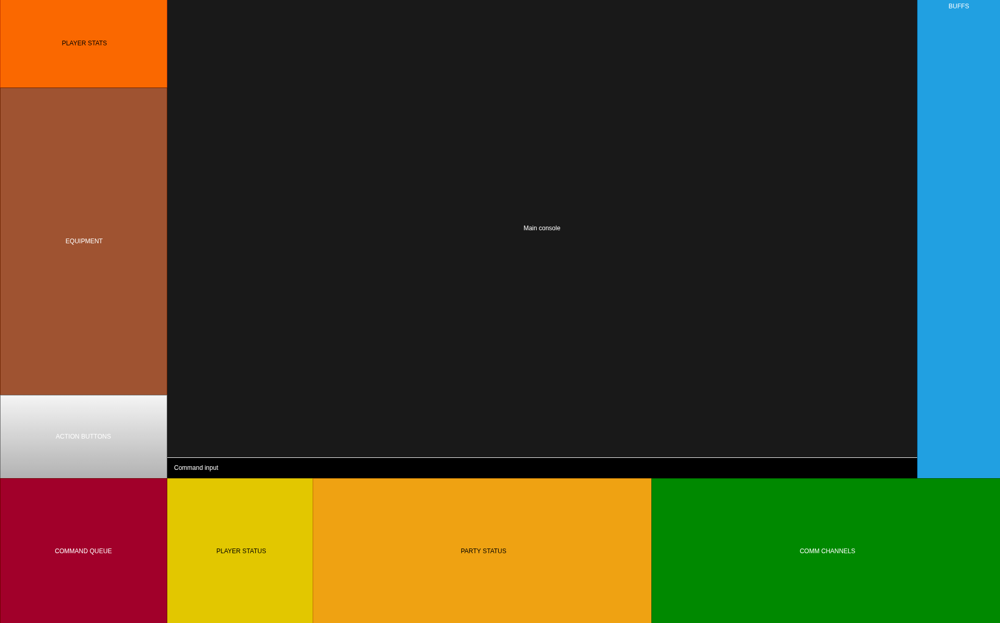

# BatUI

## BatMUD User Interface by Niliz

## Installation

TBD

## Usage

TBD

### Aliases

* `alias1 <param1>`
  * description of what the alias does, and what param1 is if it exists
    * example usage1
    * optional example usage2, etc
* `alias 2`
  * and so on, and so forth

### API

* `functionName(param1, param2)
  * Then, do the same thing for any Lua API which you want them to be able to use.
  * This part can be skipped if you have separate API documentation, but keep in mind the README.md file is accessible from the package manage in Mudlet, so this allows you to provide documentation within Mudlet, to a degree.

## Final thoughts, how to contribute, thanks, things like that

I like to put anything which doesn't fit with the above stuff here, at the end. It keeps the documentation like stuff at the top.
